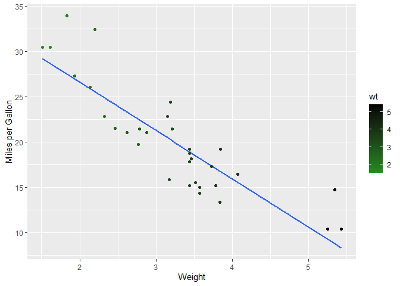

This is an example or R code.

This is how to include figures

``` r
data("mtcars")
ggplot(mtcars, aes(x = wt, y = mpg)) +
  geom_smooth(method= lm, se = FALSE)+
  geom_point(aes(color = wt)) +
  xlab("Weight")+
  ylab("Miles per Gallon")+
  scale_colour_gradient(low = "forestgreen", high = "black")
```

    ## `geom_smooth()` using formula = 'y ~ x'

<!-- -->

R markdown formatting options

# first level header

## Second level header

**this text is italics**. One asterisk is italics and two on each side
is to make the lettering bold \### Third level header

1.  one item \# if you type a dash and then a space you create a list.
    2.another item
    - one subitem
